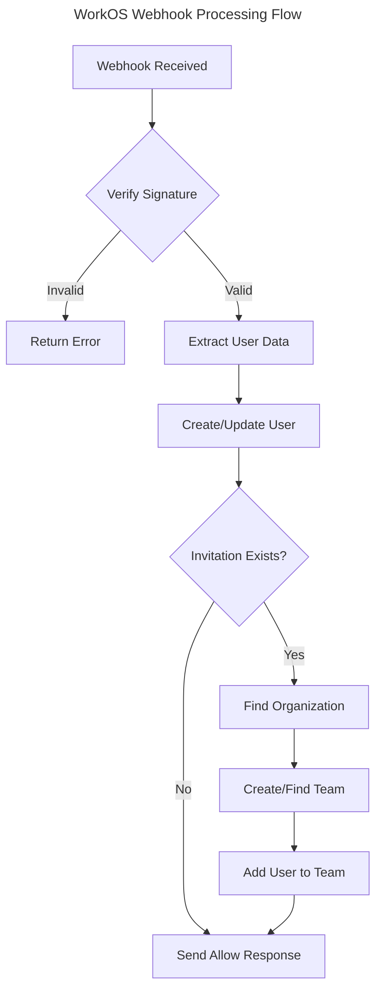

# WorkOS Webhooks

This document describes how to configure and use WorkOS webhooks within the application.

## Overview

WorkOS webhooks allow your application to receive real-time updates about events that occur within your WorkOS integration. This implementation currently supports user registration actions and organization invitations.

## Configuration Requirements

### Config File Settings

The following configuration settings are required in your `config/workos-teams.php` file:

```php
return [
    // Webhook route configuration
    'routes' => [
        'prefix' => 'webhooks', // URL prefix for webhook endpoints
        'middleware' => ['api'], // Middleware applied to webhook routes
    ],

    // Model class mappings
    'models' => [
        'user' => \App\Models\User::class,
        'team' => \App\Models\Team::class,
        'team_invitation' => \App\Models\TeamInvitation::class,
    ],

    // WorkOS webhook secret (should be set in your .env file)
    'webhook_secret' => env('WORKOS_WEBHOOK_SECRET'),
];
```

### Environment Variables

Ensure the following variables are set in your `.env` file:

```
WORKOS_WEBHOOK_SECRET=your_workos_webhook_secret
```

## Supported Webhook Events

Currently, the following WorkOS webhook events are supported:

### User Registration Action

This event is triggered when a user completes the registration process through WorkOS. The application will:

1. Verify the webhook signature using your webhook secret
2. Create or update the user record based on the email address
3. If the user was invited to an organization, add them to the corresponding team
4. Send an allow response back to WorkOS

## Setting Up WorkOS Webhooks

To configure webhooks in your WorkOS dashboard:

1. Log in to your WorkOS dashboard
2. Navigate to the "Webhooks" section
3. Create a new webhook endpoint
4. Set the URL to `https://your-domain.com/webhooks/work-os/user-registration-action`
5. Generate a webhook secret and save it in your `.env` file
6. Select the events you want to receive (User Registration, etc.)
7. Save the webhook configuration

## Webhook Processing Flow



## Customizing Webhook Handling

You can customize the webhook handling by modifying the routes in `workos-teams/routes/webhooks.php` or by extending the repository classes used to interact with WorkOS.

> 💡 **Tip:** For complex webhook handling logic, consider creating dedicated handler classes rather than putting all the logic in the route definition.

## Troubleshooting

### Common Issues

1. **Webhook Verification Failed**
   - Check that your `WORKOS_WEBHOOK_SECRET` in the `.env` file matches the secret in your WorkOS dashboard

2. **Missing Team Invitation Model**
   - Ensure that you have defined the `TeamInvitation` model and it's properly referenced in your configuration

3. **Organization Not Found**
   - Verify that the organization exists in WorkOS and that your repository implementation can correctly retrieve it

### Debugging

To debug webhook issues:

1. Check your application logs for detailed error messages
2. Use the WorkOS dashboard to view webhook delivery attempts and responses
3. Consider using a webhook debugging tool like RequestBin for local development

## Related Documentation

- [WorkOS Webhook Documentation](https://workos.com/docs/webhooks)
- [Laravel Webhook Best Practices](https://laravel.com/docs/webhooks)