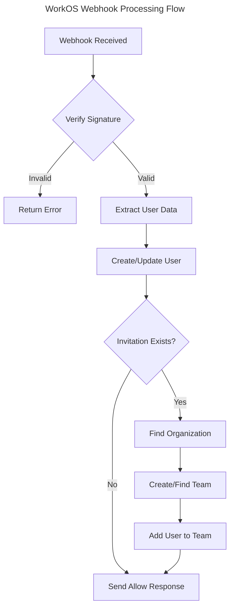

# WorkOS Webhooks

This document describes how to configure and use WorkOS webhooks within the application.

## Overview

WorkOS webhooks allow your application to receive real-time updates about events that occur within your WorkOS integration. This implementation currently supports user registration actions and organization invitations.

## Configuration Requirements

### Environment Variables

Ensure the following variables are set in your `.env` file:

```
WORKOS_WEBHOOK_SECRET=your_workos_webhook_secret
```

## Route Registration

There are two ways to implement WorkOS webhooks in your application:

### 1. Using the Built-in Route Registration

The simplest way to implement webhooks is to use the built-in route registration:

```php
use RomegaSoftware\WorkOSTeams\WorkOSTeams;

// In your routes/webhooks.php file
WorkOSTeams::webhooks()->register();
```

This will register the webhook endpoint with the uri `/user-registration-action`.

### 2. Custom Implementation

Alternatively, you can create your own webhook route and controller:

```php
Route::post('/webhooks/work-os/user-registration-action', [YourCustomController::class, 'handle']);
```

This gives you complete control over the webhook handling process while still maintaining compatibility with WorkOS's webhook system.

## Webhook Controller

The default `\RomegaSoftware\WorkOSTeams\Http\Controllers\WebhookController` provides a complete implementation for handling WorkOS webhooks. You can:

1. Use it as-is by registering the routes through `WorkOSTeams::webhooks()->register()`
2. Extend it to add custom functionality
3. Override it completely with your own implementation

The controller handles the following responsibilities:
- Webhook signature verification
- User creation/updates
- Team and organization management
- Response formatting

## Supported Webhook Events

Currently, the following WorkOS webhook events are supported:

### User Registration Action

This event is triggered when a user completes the registration process through WorkOS. The application will:

1. Verify the webhook signature using your webhook secret
2. Create or update the user record based on the email address
3. If the user was invited to an organization, add them to the corresponding team
4. Send an allow response back to WorkOS

## Setting Up WorkOS Webhooks

To configure webhooks in your WorkOS dashboard:

1. Log in to your WorkOS dashboard
2. Navigate to the "Webhooks" section
3. Create a new webhook endpoint
4. Set the URL to `https://your-domain.com/webhooks/work-os/user-registration-action`
5. Generate a webhook secret and save it in your `.env` file
6. Select the events you want to receive (User Registration)
7. Save the webhook configuration

## Webhook Processing Flow



## Customizing Webhook Handling

You can customize the webhook handling in several ways:

1. **Extend the Default Controller**
   ```php
   class YourWebhookController extends WebhookController
   {
       public function handle(Request $request)
       {
           // Add custom logic before handling
           $response = parent::handle($request);
           // Add custom logic after handling
           return $response;
       }
   }
   ```

2. **Override Individual Methods**
   The `WebhookController` provides several protected methods that you can override to customize specific behaviors:

   ```php
   class YourWebhookController extends WebhookController
   {
       protected function getWebhookSecret(): ?string
       {
           // Customize how the webhook secret is retrieved
           return config('your-custom-config.webhook_secret');
       }

       protected function verifyWebhook(Request $request, string $webhookSecret): ?WebhookResource
       {
           // Customize webhook verification logic
           return parent::verifyWebhook($request, $webhookSecret);
       }

       protected function handleUserCreation(WebhookResource $webhookResponse): User
       {
           // Customize user creation/update behavior
           $user = parent::handleUserCreation($webhookResponse);

           // Add additional user setup
           $user->update(['custom_field' => 'value']);

           return $user;
       }

       protected function handleTeamInvitation(WebhookResource $webhookResponse, User $user): void
       {
           // Override the entire team invitation flow
           parent::handleTeamInvitation($webhookResponse, $user);
       }

       protected function createOrUpdateTeam(string $teamModel, WebhookResource $webhookResponse, $organization): ?Team
       {
           // Customize team creation logic
           return parent::createOrUpdateTeam($teamModel, $webhookResponse, $organization);
       }

       protected function updateUserTeam(User $user, Team $team): void
       {
           // Customize how the user's current team is updated
           $user->updateQuietly([
               'current_team_id' => $team->getKey(),
               'team_joined_at' => now(),
           ]);
       }

       protected function handleTeamMembership(Team $team, User $user, WebhookResource $webhookResponse, string $teamInvitationModel): void
       {
           // Customize team membership handling
           $team->addMember($user, 'admin'); // Always add as admin
       }

       protected function createWebhookResponse(string $webhookSecret): \Illuminate\Http\JsonResponse
       {
           // Customize the webhook response format
           $response = parent::createWebhookResponse($webhookSecret);

           // Add additional data to the response
           $response->setData(array_merge($response->getData(), [
               'custom_field' => 'value',
           ]));

           return $response;
       }
   }
   ```

3. **Create Your Own Controller**
   - Implement your own webhook handling logic
   - Maintain compatibility with WorkOS's webhook system
   - Handle the webhook signature verification yourself

## Troubleshooting

### Common Issues

1. **Webhook Verification Failed**
   - Check that your `WORKOS_WEBHOOK_SECRET` in the `.env` file matches the secret in your WorkOS dashboard
   - If using a custom `getWebhookSecret()` method, verify it returns the correct secret

### Debugging

To debug webhook issues:

1. Check your application logs for detailed error messages
2. Use the WorkOS dashboard to view webhook delivery attempts and responses
3. Consider using a webhook debugging tool like RequestBin for local development
4. When overriding methods, add logging to track the flow of execution:
   ```php
   protected function handleUserCreation(WebhookResource $webhookResponse): User
   {
       \Log::info('Creating/updating user', [
           'email' => $webhookResponse->user_data->email,
       ]);

       $user = parent::handleUserCreation($webhookResponse);

       \Log::info('User created/updated', [
           'user_id' => $user->id,
       ]);

       return $user;
   }
   ```

## Related Documentation

- [WorkOS Webhook Documentation](https://workos.com/docs/webhooks)
- [Laravel Webhook Best Practices](https://laravel.com/docs/webhooks)